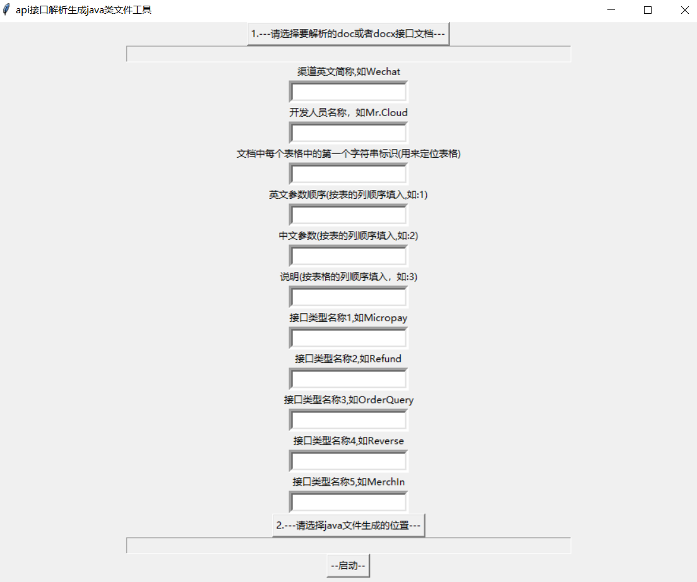

# Parse-Api

##### Parse-Api是通过选取doc文件或docx文件，根据文档中的接口表单内容和GUI输入的一些参数信息，自动生成java实体类文件到指定的文件夹下的代码生成工具

#Update log
16October 2020 update log
1. add Add a format checkbutton judgment

15 October 2020 update record
1. Covert it to snake case when variable is camel.
2. Add test.py file
3. Support pdf file
4. Fixed doc file selection twice

***
### 

目前仅仅支持doc和docx，pdf和网页版后续看情况优化

|工具|说明|
|:----:|:----:|
|python3.8|3.8|
|pycharm|开源免费的IDE|
|tkinter|python图形化操作|
|python类库docx|操作docx文档|
|python类库win32com.client|将doc文件转换成docx文件|
|python类库pyinstaller|将python打包成exe可执行文件|

***
# 使用说明
1. 双击小黄猫exe文件打开操作界面
2. 选取docx文件，如果是doc文件，选取后直接点击启动，会在同级目录生成docx文件，然后重新选取（后续升级优化）
3. 输入渠道英文简称，首字母需要大写，程序会根据此参数生成类名和文件名
4. 开发人员名称，会将输入的内容生成到注释当中
5. 这一步非常非常关键！将对接文档打开，找到你的第一个接口表格，然后看表格的第一行第一列的值是什么就输入到字符串标识中，如果有其他不是接口文档的表格的第一行第一列和他相同，那么就想办法将其他的先改成其他不相等的值，或者将所有你要生成的接口统一改成你的名字也可以（根据唯一标识识别表格内容）
6. 英文参数顺序就是表格中列数，程序根据这个位置生成变量，后续会优化支持下划线转驼峰或驼峰转下划线，以及是否@JsonField等内容。
7. 中文参数和说明就是将这个列中的内容生成到注解里，规范注解格式
8. 填写接口类型名称，按照文档从上到下的顺序，不需要区分request和response，例如OrderQuery等，根据这些参数和渠道参数生成类名和文件名。
9. 选择将java文件生成到哪个文件夹下。
10. 点击启动，然后等待几秒，到对应文件夹下查看，进行少量修改即可。